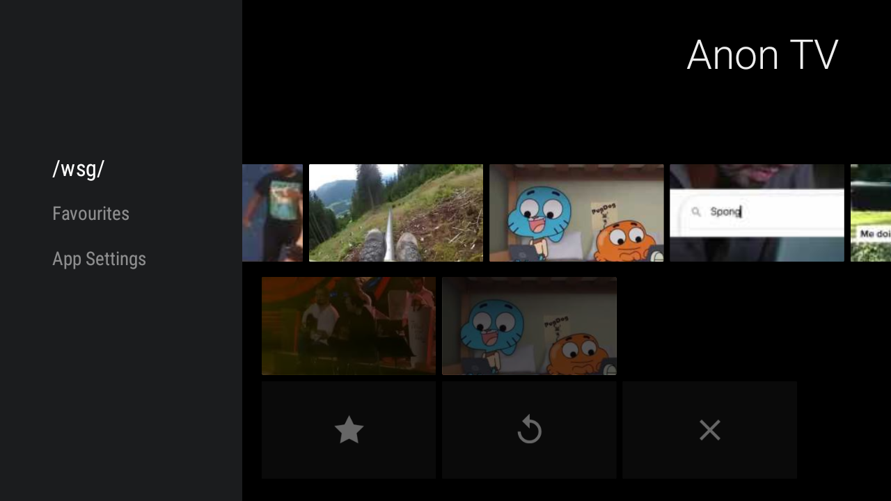
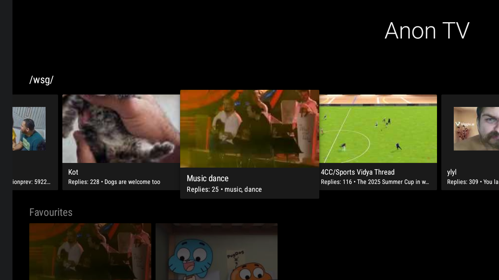
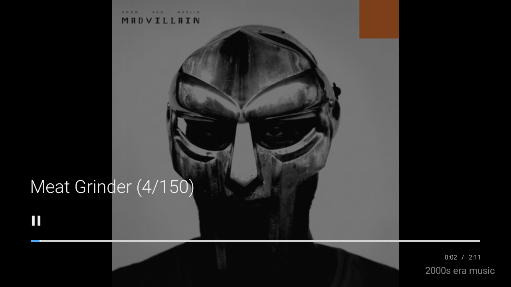

# Anon TV

<p align="center">
  
</p>

**Anon TV** is a Google TV application for browsing imageboard media.

Built with modern Android development practices, Anon TV offers a seamless experience for viewing `.webm` and image content from popular imageboards directly on your television. It emphasizes performance and intuitive navigation on TV devices.

---

## ✨ Features

* **Thread Browsing** – Explore and view active threads.
* **Media Playback** – Watch `.webm` videos and view images from selected threads.
* **Full-Screen Viewer** – Enjoy an immersive viewing experience.
* **Remote Navigation** – Use your TV remote (left/right) to navigate media.
* **Back Navigation** – Quickly return to thread view.
* **Content Refresh** – Reload threads directly from the main menu.

---

## 📸 Screenshots

<div align="center">
  <table>
    <tr>
      <td align="center">
        <a href="Docs/Images/Menu_Sidebar.png">
          
        </a>
        <br/>
        <em>Main menu with sidebar navigation</em>
      </td>
      <td align="center">
        <a href="Docs/Images/Menu_Threads.png">
          
        </a>
        <br/>
        <em>Thread browsing interface</em>
      </td>
    </tr>
    <tr>
      <td align="center">
        <a href="Docs/Images/Video_Controls.png">
          
        </a>
        <br/>
        <em>Video player with controls</em>
      </td>
      <td align="center">
        <a href="Docs/Images/Video_NoControls.png">
          
        </a>
        <br/>
        <em>Immersive video playback</em>
      </td>
    </tr>
  </table>
</div>

---

## 🛠 Tech Stack

* **Language:** Kotlin
* **Build Tool:** Gradle
* **Media Player:** ExoPlayer
* **Networking:** Ktor
* **Serialization:** Kotlinx Serialization
* **Android Libraries:** AndroidX & Leanback

---

## 🚀 Getting Started

You can run Anon TV on your Android TV by either **sideloading the APK** or **building from source**.

### Option 1: Sideloading the APK (Recommended)

#### 1. Download the APK

* Visit the [releases page](https://github.com/Ph-ill/Anon-TV/releases)
* Download the latest `.apk` (e.g., `AnonTV-vX.X.X.apk`)

#### 2. Prepare Your Google TV

* Enable **Developer Options**:

  * Go to **Settings > System > About**
  * Tap **Android TV OS build** 7 times
* Enable **Unknown Sources**:

  * Go to **Settings > Apps > Security & Restrictions**
  * Allow unknown sources for your file manager or sideloading app

#### 3. Transfer the APK to Your TV

**Option A: Send Files to TV**

1. Install [Send Files to TV](https://play.google.com/store/apps/details?id=com.yablio.sendfilestotv) on both phone and TV
2. Transfer the `.apk` to your TV
3. Open the file using a manager like **X-plore** or **FX File Explorer**

**Option B: Downloader App**

1. Install **Downloader** from the Play Store
2. Open it and enter the direct APK URL (e.g., from GitHub)
3. Download and install

#### 4. Install Anon TV

* Locate and open the `.apk` file
* Follow on-screen prompts
* Launch Anon TV from the app drawer

---

### Option 2: Building from Source (For Developers)

#### Prerequisites

* Android Studio
* Android SDK (API 34+)
* JDK 1.8+
* Git

#### Build Instructions

```bash
git clone https://github.com/Ph-ill/Anon-TV.git
cd Anon-TV
```

Create `local.properties` with your SDK path:

```properties
sdk.dir=/path/to/your/android/sdk
```

Build the app:

```bash
./gradlew assembleDebug
```

Install the APK via ADB:

```bash
adb install app/build/outputs/apk/debug/app-debug.apk
```

---

### ADB Installation

* **Windows**: [Platform Tools Download](https://developer.android.com/studio/releases/platform-tools)
* **macOS**: `brew install android-platform-tools`
* **Linux**: `sudo apt install adb` or similar

---

## 🗺 Roadmap

* Multi-imageboard support
* Search functionality
* Enhanced UI and customization
* Local caching for offline use
* Settings screen
* Better error handling and user feedback

---

## 🤝 Contributing

Pull requests and suggestions are welcome!
Open an issue or fork and contribute directly.

---

## 📄 License

Licensed under the **MIT License**.
See the `LICENSE` file for details.
