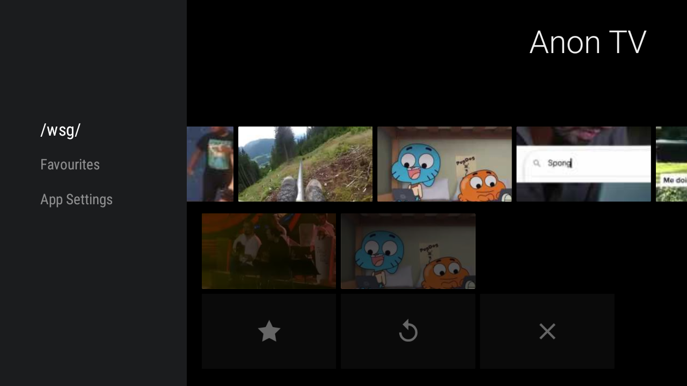
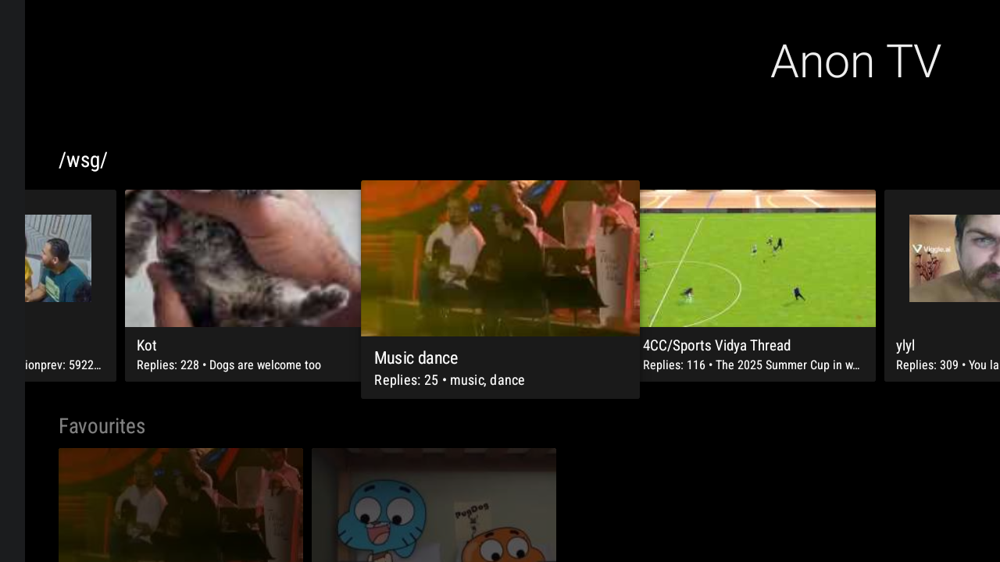
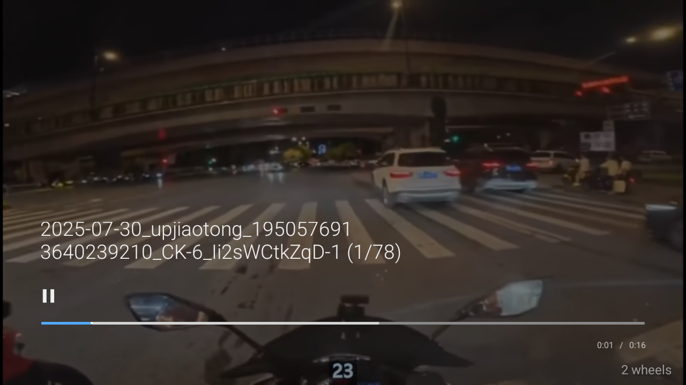
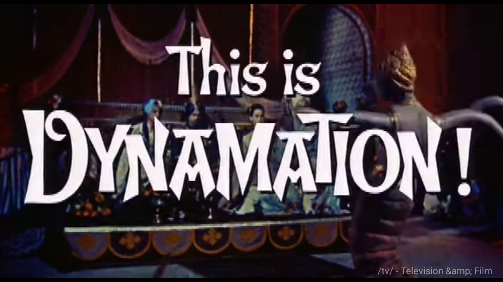

# Anon TV

<p align="center">
  
</p>

**Anon TV** is a Google TV application for browsing imageboard media with a modern, customizable interface.

Built with Kotlin and Android Leanback, Anon TV provides a seamless TV-optimized experience for viewing `.webm` videos and images from imageboards. Features multiple themes, content organization, and performance-optimized browsing.

---

## ✨ Features

### Core Functionality
* **Thread Browsing** – Browse and view active threads with 30-thread batch loading
* **Media Playback** – Watch `.webm` videos and view images with ExoPlayer integration
* **TV Remote Navigation** – Full D-pad and remote control support
* **Auto-Loading** – Automatic content loading when reaching the end of the list

### Content Management
* **Favourites System** – Save threads for quick access across app restarts
* **Hide Threads** – Remove unwanted threads from the browse list
* **Restore Hidden Threads** – Bulk restore all previously hidden content
* **Thread Position Memory** – Resume media playback from last viewed position

### Interface & Theming
* **Multiple Themes** – Light, Dark, and System theme options
* **Instant Theme Switching** – Thread data caching eliminates loading delays
* **High-Resolution Icons** – 48dp vector graphics optimized for TV displays
* **Custom Popup Menus** – Long-press thread cards for quick actions

### Performance
* **Smart Caching** – 5-minute thread data cache for smooth theme switching
* **Batch Loading** – Load 30 threads per request for faster browsing
* **Memory Efficient** – Automatic cache expiration and cleanup

---

## 📸 Screenshots

<div align="center">
  <table>
    <tr>
      <td align="center">
        <a href="Docs/Images/Menu_Sidebar_v2.png">
          
        </a>
        <br/>
        <em>Main interface with sidebar navigation</em>
      </td>
      <td align="center">
        <a href="Docs/Images/Menu_Threads_v2.png">
          
        </a>
        <br/>
        <em>Thread browsing with high-resolution icons</em>
      </td>
    </tr>
    <tr>
      <td align="center">
        <a href="Docs/Images/Video_Controls_v2.png">
          
        </a>
        <br/>
        <em>Video player with overlay controls</em>
      </td>
      <td align="center">
        <a href="Docs/Images/Video_NoControls_v2.png">
          
        </a>
        <br/>
        <em>Full-screen video playback</em>
      </td>
    </tr>
  </table>
</div>

---

## 🛠 Tech Stack

* **Language:** Kotlin
* **Build System:** Gradle 8.14.3
* **Media Player:** ExoPlayer with Leanback integration
* **Networking:** Ktor HTTP client
* **Serialization:** Kotlinx Serialization JSON
* **UI Framework:** Android Leanback for TV interfaces
* **Image Loading:** Glide with caching
* **Architecture:** Fragment-based with MVVM patterns

---

## 🚀 Installation

### Download Pre-built APK (Recommended)

#### 1. Download Latest Release
* Visit the [releases page](https://github.com/Ph-ill/Anon-TV/releases)
* Download the latest `app-debug.apk`

#### 2. Enable Developer Options on Google TV
```
Settings > System > About > Android TV OS build (tap 7 times)
Settings > Apps > Security & Restrictions > Unknown sources (enable)
```

#### 3. Install APK
**Method A: Send Files to TV**
1. Install [Send Files to TV](https://play.google.com/store/apps/details?id=com.yablio.sendfilestotv)
2. Transfer APK from phone to TV
3. Install using file manager

**Method B: ADB Installation**
```bash
adb install app-debug.apk
```

**Method C: Downloader App**
1. Install Downloader from Google Play Store
2. Enter APK URL from GitHub releases
3. Download and install directly

---

## 🔧 Building from Source

### Prerequisites
* Android Studio 2024.1+
* Android SDK API 34
* JDK 8+
* Git

### Build Steps
```bash
git clone https://github.com/Ph-ill/Anon-TV.git
cd Anon-TV
```

Create `local.properties`:
```properties
sdk.dir=/path/to/android/sdk
```

Build debug APK:
```bash
./gradlew assembleDebug
```

Install to device:
```bash
adb install app/build/outputs/apk/debug/app-debug.apk
```

### Development Tools
* **ADB**: `sudo apt install adb` (Linux) / `brew install android-platform-tools` (macOS)
* **GitHub CLI**: `gh` for automated releases and issue management

---

## 📖 User Guide

### Navigation
* **D-Pad**: Navigate between thread cards and menu items
* **OK/Enter**: Select threads or menu options
* **Back**: Return to previous screen or exit video
* **Long Press**: Show thread action menu (Favourite/Hide)

### Menu Structure
* **Threads (/wsg/)**: Main thread browsing area
* **Favourites**: Saved threads for quick access
* **App Settings**: Theme selection and hidden thread management

### Theme Management
* Access via App Settings > Theme Settings
* Choose from Light, Dark, or System themes
* Instant switching with cached thread data

### Content Management
* **Long press** any thread card for action menu
* **Favourite**: Save to Favourites section (persistent across restarts)
* **Hide**: Remove from thread list
* **Restore Hidden**: Bulk restore all hidden threads from App Settings

---

## 📚 Release Naming Convention

APK files follow this pattern for consistency:
```
AnonTV-v[VERSION].apk
```
Example: `AnonTV-v0.2.3.apk`

All releases use debug APKs as the app will not be published to Google Play Store.

---

## 🤝 Contributing

### Git Workflow
* Commit messages should be factual and technical
* Use conventional commit prefixes: `feat:`, `fix:`, `perf:`, `chore:`
* Avoid marketing language in commit notes

### Development
1. Fork the repository
2. Create feature branch
3. Make changes with appropriate tests
4. Submit pull request with clear description

---

## 📄 License

Licensed under the **MIT License**. See `LICENSE` file for details.

---

## 🔄 Version History

* **v0.2.3** - Thread caching optimization, instant theme switching
* **v0.2.2** - Enhanced icons, 30-thread batch loading
* **v0.2.1** - Favourites system, hide threads, popup menus
* **v0.2.0** - Theming engine, performance improvements
* **v0.1.0** - Initial release with basic browsing and playback