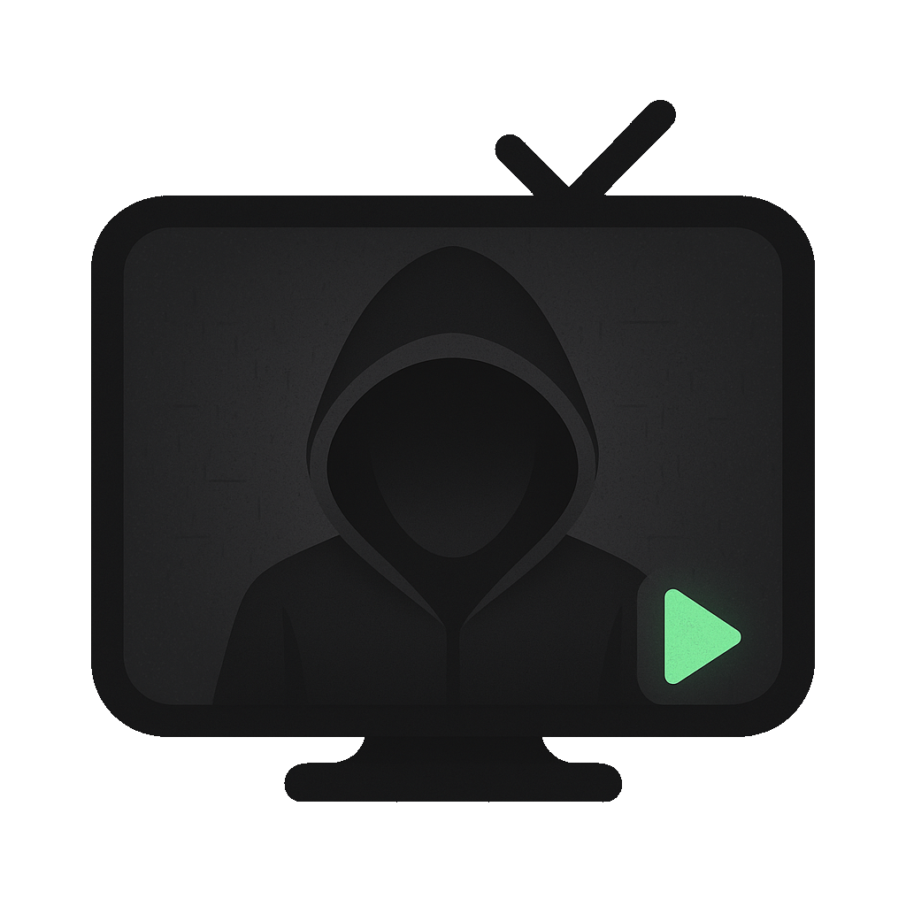

# Anon TV

<p align="center">
  
</p>

An Android TV application for browsing imageboard media.

Anon TV provides a seamless experience for viewing webm and image content from popular imageboards directly on your television. It's built with modern Android development practices, focusing on performance and user experience on TV devices.

## Features

- Thread Browsing: Navigate and view active threads from imageboards.
- Media Playback: View videos (webms) and images from selected threads.
- Full-Screen Viewer: Immersive full-screen media experience.
- Remote Navigation: Use TV remote (left/right) for media navigation.
- Back Navigation: Easily return to the thread list.
- Content Refresh: Refresh threads from the main menu.

## Screenshots

<div align="center">
  <table>
    <tr>
      <td align="center">
        <a href="Docs/Images/Menu_Sidebar.png">
          
        </a>
        <br/>
        <em>Main menu with sidebar navigation</em>
      </td>
      <td align="center">
        <a href="Docs/Images/Menu_Threads.png">
          
        </a>
        <br/>
        <em>Thread browsing interface</em>
      </td>
    </tr>
    <tr>
      <td align="center">
        <a href="Docs/Images/Video_Controls.png">
          
        </a>
        <br/>
        <em>Video player with controls visible</em>
      </td>
      <td align="center">
        <a href="Docs/Images/Video_NoControls.png">
          
        </a>
        <br/>
        <em>Immersive video viewing experience</em>
      </td>
    </tr>
  </table>
</div>

## Tech Stack

- **Language:** Kotlin
- **Build Tool:** Gradle
- **Video Player:** ExoPlayer
- **Networking:** Ktor
- **Serialization:** Kotlinx Serialization
- **Android Libraries:** AndroidX & Leanback

## Getting Started

There are two ways to get Anon TV running on your Android TV device: building from source or sideloading the pre-built APK.

### Option 1: Sideloading the APK (Recommended for Users)

This is the easiest way to get Anon TV running on your Android TV device.

#### Prerequisites
- Android TV device or Android TV emulator
- USB cable (for physical devices) or ADB over network
- ADB (Android Debug Bridge) installed on your computer

#### Installation Steps

1. **Download the APK:**
   - Go to the [Releases page](https://github.com/Ph-ill/Anon-TV/releases)
   - Download the latest `app-debug.apk` file

2. **Enable Developer Options on your Android TV:**
   - Go to Settings → About
   - Find "Build number" and tap it 7 times
   - Go back to Settings → Developer options
   - Enable "USB debugging" and "Install via USB"

3. **Connect your device:**
   - **Physical device**: Connect via USB cable
   - **Emulator**: Start Android TV emulator via Android Studio
   - **Network**: Enable ADB over network in developer options

4. **Install the APK:**
   ```bash
   adb install app-debug.apk
   ```

5. **Launch Anon TV:**
   - Find "Anon TV" in your Android TV app launcher
   - Launch the app and start browsing content

### Option 2: Building from Source (For Developers)

This approach is for developers who want to modify the code or contribute to the project.

#### Prerequisites

*   Android Studio (recommended for development and emulator setup)
*   Android SDK (API 34 or higher)
*   Java Development Kit (JDK) 1.8 or higher
*   Git

#### Build Instructions

1.  **Clone the repository:**
    ```bash
    git clone https://github.com/Ph-ill/Anon-TV.git
    cd Anon-TV
    ```

2.  **Set up Android SDK (if not already configured):**
    Create a `local.properties` file in the project root and add your SDK path:
    ```properties
    sdk.dir=/path/to/your/android/sdk
    ```
    (e.g., `/home/youruser/Android/Sdk`)

3.  **Build the project:**
    ```bash
    ./gradlew assembleDebug
    ```
    The debug APK will be located at `app/build/outputs/apk/debug/app-debug.apk`.

4.  **Install on device/emulator:**
    ```bash
    adb install app/build/outputs/apk/debug/app-debug.apk
    ```

### Troubleshooting

#### Common Issues

- **"App not installed" error**: Make sure USB debugging is enabled and you've allowed installation from unknown sources
- **ADB not recognized**: Install Android SDK Platform Tools or use Android Studio's built-in ADB
- **Build errors**: Ensure you have the correct JDK version and Android SDK installed
- **Emulator issues**: Use Android Studio's Device Manager to create and manage Android TV emulators

#### Getting ADB

- **Windows**: Download [Android SDK Platform Tools](https://developer.android.com/studio/releases/platform-tools)
- **macOS**: `brew install android-platform-tools`
- **Linux**: `sudo apt install adb` (Ubuntu/Debian) or equivalent for your distribution

## Future Enhancements (Roadmap)

*   **Multi-Imageboard Support:** Allow users to configure and browse content from various imageboards beyond the initial implementation.
*   **Search Functionality:** Implement search capabilities for threads and posts.
*   **User Interface Improvements:** Enhance the visual design and add more customization options.
*   **Caching:** Implement local caching for faster loading times and offline browsing.
*   **Settings Screen:** Add a dedicated settings screen for user preferences.
*   **Error Handling & Feedback:** More robust error handling and user-friendly feedback mechanisms.

## Contributing

Contributions are welcome! If you have suggestions for improvements or new features, please open an issue or submit a pull request.

## License

Distributed under the MIT License. See `LICENSE` for more information.